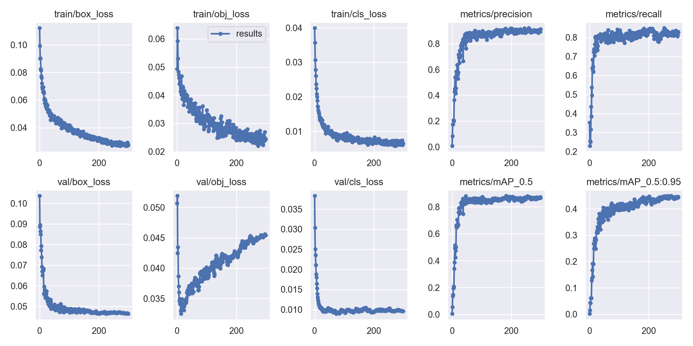

# 自动识别

施工现场目标识别与三维尺寸测量

智能建造课程第十小组实验成果整理：使用 **PyTorch / YOLOv5** 检测工人、安全帽、反光衣，使用 **RealSense / OpenCV** 开展三维长度测量与平整度检测。项目覆盖数据标注、模型训练、结果展示及几何测量两个实验模块。

本仓库由课程目录整理而来。目标检测对应实验四，深度测量对应实验三；当前材料没有机械臂控制与路径规划实现，两个模块也未实现在线联动。

## 技术流程

- 目标检测：图像筛选 → YOLO 格式框标注 → 类别顺序检查 → YOLOv5 训练 → 检测框及置信度展示。
- 尺寸测量：RGB/深度对齐 → 高斯滤波 → Canny → 概率霍夫直线检测 → 获取端点点云坐标 → 欧氏距离计算，结果显示为 cm。
- 平整度检测：选定四边形区域并采样网格 → 线性 SVR 拟合平面 → 计算点到平面距离的标准差及最大值。此处为实验统计量，未验证为工程验收标准。

## 仓库结构

```text
configs/construction.yaml   修正为本仓库相对路径的三类数据配置
yolov5/                     课程提供的 YOLOv5 运行代码及原许可证
measurement/legacy/         原始深度测量代码（依赖课程 GUI 文件）
reports/exp12/              原始训练日志、配置及带限制说明的指标摘要
assets/                     exp12 训练曲线、PR 曲线与混淆矩阵
```

## 训练与推理

以下命令为整理后的使用方式；本次未在训练环境或深度相机上重新运行。先创建 Python 环境，在 `yolov5/` 中安装 `requirements.txt` 所列依赖；PyTorch 需与本机 CUDA/CPU 环境匹配。

```bash
cd yolov5
pip install -r requirements.txt
python train.py --data ../configs/construction.yaml --weights ../weights/yolov5s.pt --batch-size 4 --epochs 300 --imgsz 640
python detect.py --weights runs/train/exp/weights/best.pt --source ../datasets/construction/test/images --save-txt --save-conf
python val.py --data ../configs/construction.yaml --weights runs/train/exp/weights/best.pt --task val
```

自行准备具有使用权限的本地数据和预训练权重，按以下结构放置。类别编号必须固定为 `0=hardhat`、`1=vest`、`2=worker`，每行标签为 `class x_center y_center width height`，坐标归一化到 0–1。

```text
datasets/construction/
  train/images/    train/labels/
  valid/images/    valid/labels/
  test/images/
weights/yolov5s.pt
```

原提交的 `data.yaml` 指向 `../crane/...`，与所在三类数据目录不一致。本仓库配置改为 `../datasets/construction`；必须先准备并核对数据，修改路径不会自动修复历史数据。

## 留存结果与局限

`reports/exp12/results.csv` 包含 300 轮记录，最后一轮（epoch 299）记录如下。这些数字是历史训练日志中的验证指标，不是本次重新测试结果，也不是 `best.pt` 的独立测试集成绩。

| Precision | Recall | mAP@0.5 | mAP@0.5:0.95 |
| --- | --- | --- | --- |
| 0.91275 | 0.82704 | 0.86825 | 0.44383 |

历史 `opt.yaml` 的 batch size 为 3，小组汇报记载为 4，故区分保留。历史训练指向 `crane/data.yaml`，该路径当前留存配置为单类；无法仅据日志确认 exp12 当时使用的完整类别配置。上述指标不应直接作为三类系统的准确率宣传。



原三类提交目录盘点：训练图片 352 张、验证图片 110 张、无标签测试图片 59 张。训练集有 12 张图片缺少同名标签及 13 个孤立标签，验证集有 60 个孤立标签。按 SHA-256 比较，训练/验证存在 16 个相同内容的图片哈希，验证/测试存在 1 个；重新训练前应去重、补齐标签并重新划分，避免评估泄漏。原数据、个人信息汇报文件、大体积权重和视频未纳入本整理仓库。

实验三汇报中的单次尺寸测量为 8.85 cm，实测 9.05 cm，绝对误差 0.20 cm（约 2.21%）。这是单次示例，不能代表整体测量精度。存在阴影边缘误检、重复线段和无效深度等限制。

## 深度测量代码的运行条件

`measurement/legacy/vc_core.py` 使用 RealSense、PyQt5、OpenCV、NumPy、SciPy、scikit-learn 等，并导入 `ui_2023110801` 和 `vc_realsense_state`。这两个课程文件未在原目录找到，因此 GUI 当前无法独立启动。`vc_fun.py` 是保留的原始线段测量函数；其 `length_threshold` 参数尚未应用，GUI 中 RGB 图像与函数 BGR 灰度转换存在约定不一致。复现时需补全 GUI、统一颜色顺序，并检查坐标边界与有效深度。

## 来源与许可证

YOLOv5 为 Ultralytics 提供的第三方框架，项目贡献是课程中的数据标注、训练配置、调试与结果整理，框架不属于小组自研。保留课程提供版本的 [AGPL-3.0 许可证](yolov5/LICENSE)。上游：[Ultralytics YOLOv5](https://github.com/ultralytics/yolov5)。课程测量代码保留原样供审阅，其作者与再分发授权范围需根据课程规定确认；本仓库不对这些文件另行赋予宽松开源许可。
